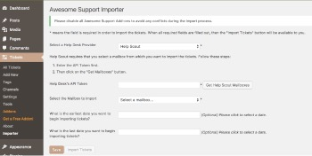
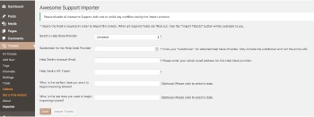

# Awesome Support: Importer

The Awesome Support Importer is a WordPress and Awesome Support plugin.  It provides the ability to import existing tickets from various Help Desk Providers into your [Awesome Support Help Desk](https://awesomesupport.com/).  

This plugin includes support for the following Help Desk providers:

- Help Scout
- Zendesk
- Ticksy

## Requirements

- WordPress 4.8.3+
- PHP 5.6+
- Awesome Support 4.3+

## Installation

### From GitHub

Navigate to your project's `plugins` folder.  Then using your favorite command line app, type:

```
git clone git@github.com:pressware/awesome-support-importer.git && cd awesome-support && composer install --no-dev
```

In this one command, the plugin is installed into your project's `plugins/awesome-support-importer` folder and composer runs to install the required dependencies.

### Using the WordPress Dashboard

1. Log into your website.
2. Then navigate to "Plugins > Add New" screen.
3. Click on the "Add New" button.
4. Click on "Upload Plugin" button.
5. Click on "Choose File" and select the `awesome-support-importer.zip` from your computer.
6. Click on "Install Now" button.
7. Then activate the Awesome Support Importer plugin.

### Using FTP

1. Extract `awesome-support-importer.zip` to your computer
2. Upload the `awesome-support-importer` directory to your `wp-content/plugins` directory
3. Activate the "Awesome Support Importer" plugin on the WordPress Plugins Dashboard

## Dependencies

You'll need composer installed on your machine, as it manages the dependencies.  _If you're not familiar with Composer, check out the [Quick Start Guide](https://getcomposer.org/doc/00-intro.md).

Composer installs the required dependencies:

- [Guzzle HTTP](http://docs.guzzlephp.org/en/stable/) - Handles all HTTP endpoint requests to the remote, RESTful Help Desk's API.
- [Monolog](https://seldaek.github.io/monolog/) - Handles writing error and information logs, which will be located in the `log` folder within your plugin.  The folder location is configurable.
- [Fulcrum Extender](https://github.com/wpfulcrum/extender) - extends array and string functionality including working with deeply nested arrays using a "dot" notation syntax (from Laravel). 

## Importing

Once the plugin is installed and activated, go to "Tickets > Importer".  

1. Select the Help Desk Provider from which you will import existing tickets into Awesome Support.
2. Fill in your credentials into each form field.
3. If you wish to import tickets within a certain date range, select the earliest and/or latest date.
4. Click "Save" button to save your credentials and query parameters.
5. The "Import Tickets" button then is available.  Click it to start the importing process.
6. Stay on this page until it's done.

>Be patient. Stay on this page and let it do its work.

Depending upon how many tickets there are to be imported as well as your internet connection speed, the importing process can take a long time, i.e. several minutes or longer.  

When it's done, you'll get a report back of how many tickets and replies were processed.  If an error occurs, an error message is displayed to let you know what happened.  The logs will provide more details.

### Help Scout



Help Scout requires an API Token, which you register within your Help Scout dashboard.  To get your API Key (token), do the following:

1. Log into your Help Scout account.
2. Go to "Your Profile" by clicking on the user icon.
3. Go to the "Authentication" page.
4. Click on the "API Keys" tab.
5. Then click on the "Generate an API Key" button. Give your new key a label.

Now follow these steps to import your tickets:
1. Copy the API Key and then paste it into the Importer's "Help Desk's API Token" field in your WordPress dashboard.
2. You will need to select which mailbox from which to import the tickets.  Click on the "Get Help Scout Mailboxes" button.  The plugin requests all of the mailboxes from your Help Scout account and then populates the "Select the Mailbox to import" `<select>` field.  You will receive a message when the mailboxes are populated and the request is complete.
3. When it's done, then select a mailbox.
4. If you'd like to get tickets within a certain date range, select that range in the date fields.
5. Click the "Save" button. The information you entered is saved.
6. Click on the "Import Tickets" button.
7. Stay on this page. Please be patient, as it can take awhile.  Take a break while it does its work.

### Zendesk



Zendesk the following credentials from your Zendesk account:

1. The subdomain for your Help Desk account
2. Your account's email address
3. A Zendesk API Token

Log into your Zendesk account and generate a API token.

Follow these steps to import your tickets:
1. Enter your subdomain.
2. Enter the email associated with your Zendesk account.
3. Copy the API token and then paste it into the Importer's "Help Desk's API Token" field in your WordPress dashboard.
4. If you'd like to get tickets within a certain date range, select that range in the date fields.
5. Click the "Save" button. The information you entered is saved.
6. Click on the "Import Tickets" button.
7. Stay on this page. Please be patient, as it can take awhile.  Take a break while it does its work.

### Ticksy


Ticksy the following credentials from your Zendesk account:

1. The subdomain associated with your Ticksy account
2. A Ticksy API Token

To get your credentials, do the following:

1. Log into your Ticksy account.
2. Click on the user icon and select "Edit Profile".
3. Click on the "API Credentials" option.
4. Generate your credentials if this is the first time.

Follow these steps to import your tickets:
1. Copy your Ticksy domain into the subdomain form field on the Importer screen in your WordPress dashboard.
2. Copy the "key" and then paste it into the Importer's "Help Desk's API Token" field in your WordPress dashboard.
3. If you'd like to get tickets within a certain date range, select that range in the date fields.
4. Click the "Save" button. The information you entered is saved.
5. Click on the "Import Tickets" button.
6. Stay on this page. Please be patient, as it can take awhile.  Take a break while it does its work.
